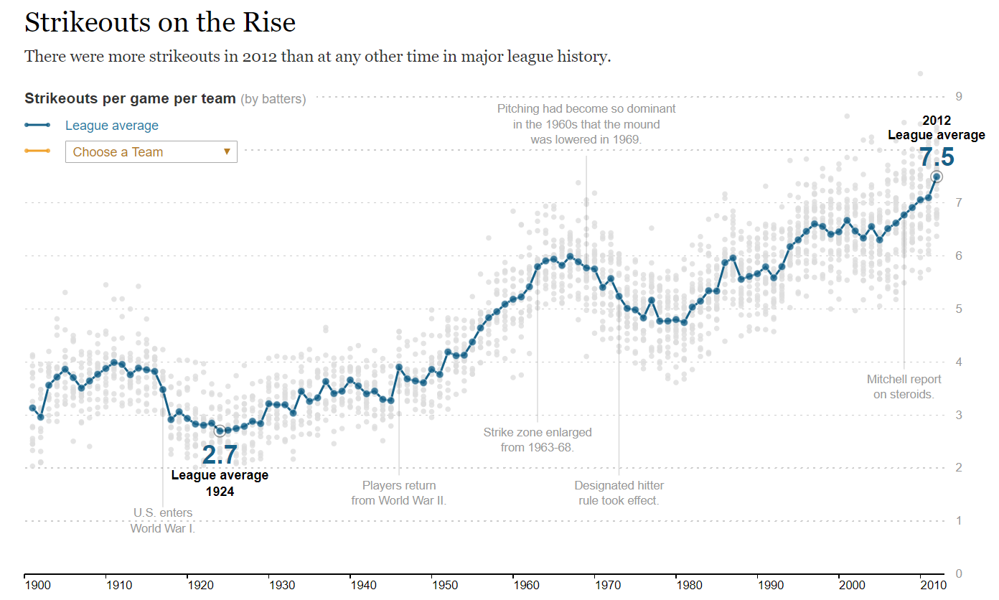

```{r setup, include=FALSE}
knitr::opts_chunk$set(echo = TRUE, message=F, warning=F)
library( dplyr )
library( pander )
```


#### [Coding in R for Policy Analytics](https://ds4ps.org/cpp-526-spr-2020/)

<br>

*This lab introduces core plotting functions in order to create customized graphics in R.*

You can create a new R Markdown file, or download the **LAB-03 RMD template**: 

<center>

[](https://github.com/DS4PS/cpp-526-sum-2020/blob/master/labs/cpp-526_reformatted-labs/Lab-03-v2-LastName.zip?raw=true)

</center>

--- 

<br>
<br>

## Replicating NYT Graphics

For this lab you will replicate the following [NYT Graphic](https://archive.nytimes.com/www.nytimes.com/interactive/2013/03/29/sports/baseball/Strikeouts-Are-Still-Soaring.html?_r=0&ref=baseball) *as closely as possible*. 

<br>




<br>
<br>

## Functions 

You will likely use the following functions. Either `plot()` or `plot.new()` and
`plot.window()`, as well as:

```{r, eval=F}
points()
gray()
axis()
title()
text()
mtext()
segments()
abline()
```

<br>
<br>

# Data

The data comes from the `Lahman` baseball data package. The **Teams** dataset contains season statistics for each baseball team from the late 1800s onward. The graph reports average strike-outs per game, which is calculated as **ave.so** below:

<br>

```{r load_data}
library(Lahman)
data(Teams)
ave.so <- Teams$SO / Teams$G
```

```{r, echo=F}
head( Teams )
```

<br>
<br>

# Preprocessing

You will need only the average strike-outs per game, and the year variables:

```{r}
ave.so <- Teams$SO / Teams$G        # Average strike-outs per game each season 
year <- Teams$yearID
```

<br>

It is advisable to keep all of the variables together inside of a data frame. Currently, `ave.so` is an active vector, but it is not in the same data frame as the other variables. 

<br>
<br>

## Creating New Variables

To create a new variable inside of an existing data frame try:

```{r eval=FALSE}
data.frame.name$new.variable.name
```

<br>

For example:

```{r}
Teams$ave.so <- Teams$SO / Teams$G
```

<br>

Make a mental note of the difference, as some functions (especially the data wrangling functions in the **dplyr** package) will require that all variables are contained within a single data frame. 

<br>

```{r, echo=T}
summary(ave.so) %>% 
  pander()                          # pander() cleanly prints data
```

<br>

**Note:** *You don't have to understand baseball to recreate the graphic.*

<br>
<br>

# Lab Instructions

Your task is to **replicate as closely as possible** the graphic 
published by the NYT.

The initial code provided below will help get you started.

<br>
<br>

#### 1.	Plot Average Strike-Outs by Year 

Since the `Lahman` data is current but the NYT Graphic is from 1900 to 2012, 
use `xlim = c()` to truncate the years.

<br>

```{r fig.align='center'}
ave.so.min <- min( ave.so, na.rm=T )
ave.so.max <- max( ave.so, na.rm=T )
plot.new()
plot.window(xlim = c(1900, 2012), 
            ylim = c(ave.so.min, 
                     ave.so.max))   # Specify dimensions
points(x = year, 
       y = ave.so)                  # Plot points
```

<br>
<br>

#### 2. Modify the Aesthetics of Plotted Points

In order to replicate the aesthetics of the NYT graphic, we can modify `points()`.

<br>

```{r fig.align='center'}
plot.new()
plot.window(xlim = c(1900, 2012), 
            ylim = c(ave.so.min, 
                     ave.so.max))   # Specify dimensions
points(x = year, 
       y = ave.so,
       col = "gray85",              # Color
       pch = 16,                    # Shape
       cex = 0.75)                  # Size
```


<br>
<br>

#### 3. Replicate the Axes 

You'll need to modify your axes a bit further, but this should get you started.

<br>

```{r fig.align='center'}
plot.new()
plot.window(xlim = c(1900, 2012), 
            ylim = c(ave.so.min, 
                     ave.so.max))   # Specify dimensions
points(x = year, 
       y = ave.so,
       col = "gray85",              # Color
       pch = 16,                    # Shape
       cex = 0.75)                  # Size
axis(side = 1,                      # Add x-axis
     lwd = 2,                       # Line width
     hadj = -0.1,                   # Horizontal label position 
     padj = -1,                     # Vertical label position
     at = seq(from = 1900, 
              to = 2010, 
              by = 10))             # Specify tick label sequence
axis(side = 4,                      # Add y-axis
     lwd = 0,                       # Remove axis line
     las = 1,                       # Rotate labels
     col.axis = "gray85",           # Adjust label colors
     at = seq(from = 0,             # Specify axis values
              to = 9, 
              by = 1), 
     font.axis = 2)                 # Set labels to bold
```

#### 4. Continue to Replicate the Graphic

Use the above recommended functions and modifications to **create as close a replication as possible**. 

<br>
<br>

## Hints

You can often rely on internal documentation as well as the web.

<br>

### Internal Documentation

If you need help looking up arguments remember these two helpful functions:

* `help()`
* `args()`

<br>

For example:

```{r, eval=F}
args(abline)
help(mtext)
```

<br>

### External Message Boards

This lab assignment will push you to explore the nuances of these 
functions and their arguments.  Don't hesitate to use the web to overcome 
challenging function modifications.

1. Include the language, i.e. "r"
2. Include the function name, e.g. `text()`
3. Concisely describe your intent, e.g. "allow text overflow" 

<br>
<br>

# How to Submit

Use the following instructions to submit your assignment, which may vary depending on your course's platform.

<br>

### Knitting to HTML

When you have completed your assignment, click the "Knit" button to render your `.RMD` file into a `.HTML` report.

<br>

### Special Instructions

Perform the following depending on your course's platform:

* **Canvas:** Upload both your `.RMD` and `.HTML` files to the appropriate link
* **Blackboard or iCollege:** Compress your `.RMD` and `.HTML` files in a `.ZIP` file and upload to the appropriate link

`.HTML` files are preferred but not allowed by all platforms.

<br>

### Before You Submit

Remember to ensure the following before submitting your assignment.

1. Name your files using this format: **Lab-##-LastName.rmd** and **Lab-##-LastName.html**
2. Show both the solution for your code and write out your answers in the body text 
3. Do not show excessive output; truncate your output, e.g. with function `head()`
4. Follow appropriate styling conventions, e.g. spaces after commas, etc.
5. Above all, ensure that your conventions are consistent

See [Google's R Style Guide](https://google.github.io/styleguide/Rguide.xml) for examples of common conventions.

<br>
<br>

### Common Knitting Issues

`.RMD` files are knit into `.HTML` and other formats procedural, or line-by-line.

* An error in code when knitting will halt the process; error messages will tell you the specific line with the error
* Certain functions like `install.packages()` or `setwd()` are bound to cause errors in knitting 
* Altering a dataset or variable in one chunk will affect their use in all later chunks
* If an object is "not found", make sure it was created or loaded with `library()` in a previous chunk

**If All Else Fails:** If you cannot determine and fix the errors in a code chunk that's preventing you from knitting your document, add `eval = FALSE` inside the brackets of `{r}` at the beginning of a chunk to ensure that R does not attempt to evaluate it, that is: `{r eval = FALSE}`. This will prevent an erroneous chunk of code from halting the knitting process.  

<br>
<br>

<style>

blockquote {
    padding: 11px 22px;
    margin: 0 0 22px;
    font-size: 18px;
    border-left: 5px solid lightgray;
}
</style>


