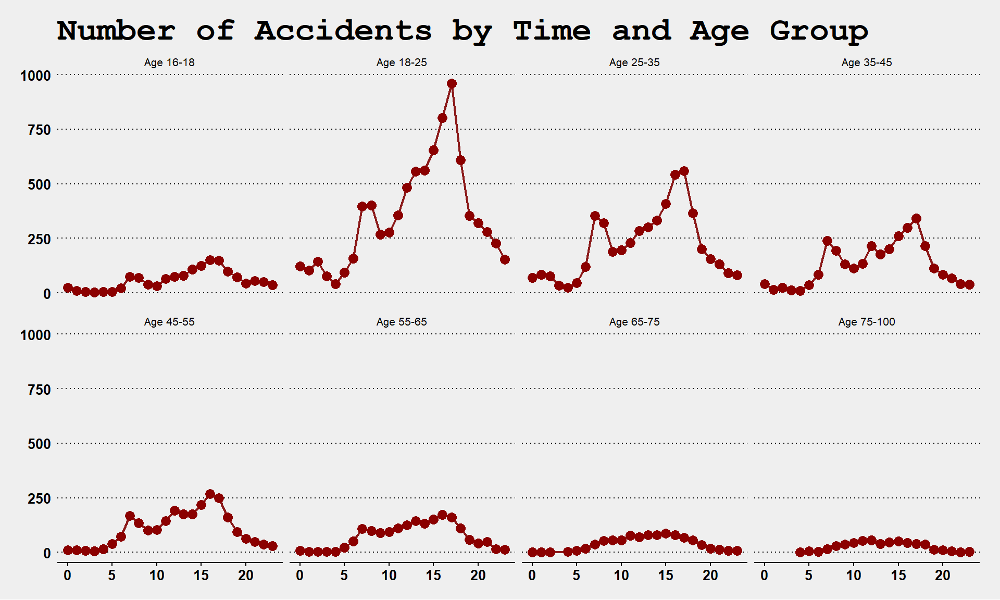
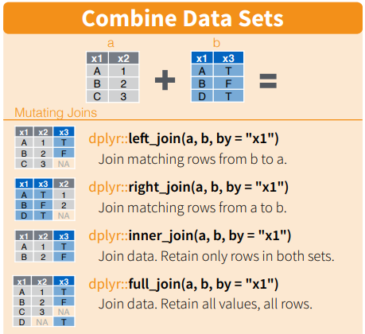
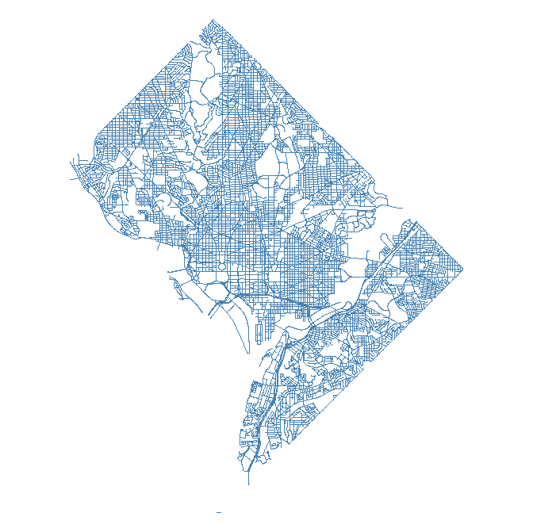

 
<!--- 
New sections start with 2 stars:  ** Section Title
New units start with 3 stars:     *** {Unit Metadata}
-----------------------------start example
** Section-I
*** { @unit = "15th Nov", @title = "Course Overview", @reading, @lecture, @assignment, @foldout }
-----------------------------end example
Unit Metadata is comprised of:
@unit - date or number
@title - unit name
@reading - turn on reading icon
@assignment - turn on lecture icon
@lecture - turn on lecture icon
@foldout - activate unit content (allow foldout)
Submit Button - <a class="uk-button uk-button-primary" href="https://gastate.view.usg.edu/d2l/home/2578896">Submit Lab</a>
-->


** Welcome

*** { @unit = "", @title = "Meet Your Instructor", @lecture, @foldout }

<br>

## About Your Instructor

Play the video below to learn a bit more about your instructor for the course, Jamison Crawford.

* Visit his [GitHub](https://github.com/jamisoncrawford) profile
* View his [RPubs](https://rpubs.com/jamisoncrawford) portfolio
* Connect on [LinkedIn](https://www.linkedin.com/in/jamisoncrawford/)

<br>

<iframe width="560" height="315" src="https://www.youtube.com/embed/C1A5x6LCDJo?rel=0&modestbranding=1&autohide=1&showinfo=0" frameborder="0" allow="accelerometer; autoplay; encrypted-media; gyroscope; picture-in-picture" allowfullscreen></iframe>

<br>

Visit the [video](https://youtu.be/C1A5x6LCDJo) to navigate using timestamps in the description or bookmarks in the progress bar.

* (**00:00**) Introduction
* (**00:07**) Two Universities, One Course
* (**01:06**) My Relationship to the Course
* (**01:38**) Teaching Experience & Course Origins
* (**02:30**) What I Do as a Data Scientist
* (**04:10**) Want a "Hard" Skill?  Do the Work!
* (**05:40**) Course Resources & Assignment Tips
* (**07:21**) Resources to Learn & Resources to Ignore
* (**09:06**) Why the "Unofficial" YouTube Channel Is Invaluable
* (**09:44**) Weekly To-Do Checklists 
* (**10:26**) Dispute Your Irrational Beliefs on Data Science
* (**11:18**) First Assignment: Introduce Yourself
* (**11:33**) Express Yourself

<br>

*** { @unit = "", @title = "The R Toolkit", @reading, @lecture, @foldout }

## Introducing R 

R is a 30-year-old statistical language created by New Zealand statisticians Robert Gentleman and Ross Ihaka as a free alternative to proprietary software for their students at the University of Auckland. In fact, its rich lineage can be directly traced to inventor and scientist Alexander Graham Bell. 

Watch the video below for a brief introduction to R as it's used today. 

<br>

<iframe src="https://player.vimeo.com/video/180644880" width="640" height="360" frameborder="0" allow="autoplay; fullscreen" allowfullscreen></iframe>

<br>

## The R Toolkit

In this course we cover the foundations of data programming with the R language. In order to create robust and dynamic analysis we need to use a couple of tools that were built to leverage the power of R and create compelling narratives. 

**RStudio** helps you manage projects by organizing files, scripts, packages and output. **Markdown** is a simple formatting convention that allows you to create publication-quality documents. **R Markdown** is a specific version of Markdown that allows you to combine text and code to create data-driven documents.

The following resources will help you get a better understanding of these tools.

* [Chapter 1: Core R](http://ds4ps.org/dp4ss-textbook/ch-010-core-r.html): Learning the basics of R

* [Chapter 2: RStudio](http://ds4ps.org/dp4ss-textbook/ch-020-rstudio.html): RStudio's functionality and features

* [Data-Driven Docs](http://ds4ps.org/dp4ss-textbook/ch-030-data-driven-docs.html): How R Markdown is used for interactive and dynamic reports

* [A Guide to Markdown](http://ds4ps.org/dp4ss-textbook/ch-031-markdown.html): How to use Markdown - the easy-to-learn formatting syntax

<br>

## Visualizing Tooling

Each tool you'll use in this course has a corresponding image, summarized below. 

<br>


<br>

## R Markdown

You will get plenty of practice with these tools and submit your labs as knitted R Markdown (`.RMD`) files.

* Learn more abour R Markdown here: [Getting Started with R Markdown](https://rmarkdown.rstudio.com/lesson-1.html)
* View R Markdown in action in the below image

<br>

[](../gifs/NewCodeChunk/NewCodeChunk.html)

<br>
<br>

*** { @unit = "", @title = "Videos", @lecture, @foldout }

<br>

## Getting to Know RStudio

RStudio is a graphical user interface (GUI) and integrated developer environment (IDE) that makes it much easier to use R for writing code, importing data, installing packages, and other features.

<br>

#### RStudio: A Guided Tour

The following video provides a tour of the RStudio interface and key components for getting started.

* What is RStudio?
* Executing and scripting commands
* Point-and-click and keyboard shorcuts
* Major interface components and features

<br>
 
<iframe width="560" height="315" 
src="https://www.youtube.com/embed/xgPwDlAtuNI??rel=0&modestbranding=1&autohide=1&showinfo=0" 
frameborder="0" allow="accelerometer; 
autoplay; encrypted-media; gyroscope; 
picture-in-picture" allowfullscreen></iframe>
 
<br>

Visit the [video](https://youtu.be/xgPwDlAtuNI) to navigate using timestamps in the description or bookmarks in the progress bar.

* (**00:00**) Introduction & Defining Integrated Development Environments (IDE)
* (**00:41**) The Five Key Components of RStudio
* (**02:17**) Using the Console vs. Using Scripts
* (**04:29**) Shortcuts: Jumping Around, Full Screen, Saving
* (**05:27**) How to Save an R Script
* (**06:36**) Shortcuts: Moving Between & Exiting Scripts
* (**07:19**) "Session" & Setting Working Directories
* (**08:07**) Exporting Data as CSV Files
* (**09:04**) "Tools" & Customizing Your RStudio Interface
* (**10:02**) "Help" & Accessing Cheat Sheets
* (**10:42**) Global Environment & Objects
* (**13:20**) RStudio's Data Import Wizard
* (**14:35**) "Files" & Directory Contents
* (**14:57**) "Plots" & Graphics in R
* (**15:44**) "Help" & Documentation
* (**17:01**) Conclusions

<br>
<br>

## Easy Formatting with Markdown

Markdown is a "lightweight", easy-to-learn syntax that allows you to format language with boldface, italicization, bullet points, and more, even when there's no "rich content editor" menu available.  

Websites and applications that support Markdown may surprise you, including:

* Reddit
* GitHub
* RStudio
* OpenStreetMap
* Stack Exchange
* Microsoft Teams

<br>

#### Markdown Basics

The following video provides a brief introduction to Markdown fundamentals.

* Headers & Sub-Headers
* Boldface & Italicization
* Ordered & Unordered Lists
* List Sub-Items & Hyperlinks

<br>
 
<iframe width="560" height="315" 
src="https://www.youtube.com/embed/oXgFrUq6btQ??rel=0&modestbranding=1&autohide=1&showinfo=0" 
frameborder="0" allow="accelerometer; 
autoplay; encrypted-media; gyroscope; 
picture-in-picture" allowfullscreen></iframe>
 
<br>

Visit the [video](https://youtu.be/oXgFrUq6btQ) to navigate using timestamps in the description or bookmarks in the progress bar.

* (**00:00**) What Is Markdown?
* (**01:17**) Demonstrating Markdown in RStudio
* (**02:00**) Typing Human-Readable Language
* (**02:27**) Creating Headers
* (**02:57**) Creating Sub-Headers
* (**04:35**) Formatting Boldface & Italicization
* (**05:58**) Creating Unordered & Ordered Lists
* (**07:04**) Creating List Sub-Items
* (**08:23**) Formatting Hyperlinks
* (**09:38**) Conclusion

<br>
<br>

## Understanding GitHub Issues

GitHub Issues allow you to quickly troubleshoot issues with instructors and peers by sharing code, reproducing errors, and thoroughly explaining complications as you learn R.

<br>

#### GitHub Issues: A Tutorial

The following video provides a tutorial for using GitHub Issues.

* Locating the Issues page
* Exploring previously posted Issues
* Creating, labeling, and assigning collaborators

<br>
 
<iframe width="560" height="315" 
src="https://www.youtube.com/embed/cHBFusiPyLw??rel=0&modestbranding=1&autohide=1&showinfo=0" 
frameborder="0" allow="accelerometer; 
autoplay; encrypted-media; gyroscope; 
picture-in-picture" allowfullscreen></iframe>
 
<br>

Visit the [video](https://youtu.be/cHBFusiPyLw) to navigate using timestamps in the description or bookmarks in the progress bar.

* (**00:00**) Introduction
* (**00:55**) Getting to the Issues Page: A Shortcut
* (**01:42**) The Issues Page
* (**02:08**) Exploring Posted Issues
* (**02:40**) Viewing an Example Issue
* (**03:24**) Recommended: Browse Issues Before Posting
* (**03:46**) Creating a New Issue: The Title
* (**04:18**) Labeling Issues & Assigning Collaborators
* (**04:46**) The Body Text: Explaining Your Issue
* (**05:45**) Examples of Best Practices
* (**06:19**) Formatting with Markdown
* (**07:15**) Conclusion

<br>
<br>

## What Is R Markdown?

R Markdown is one of the most powerful tools you'll learn. It allows the synthesis of human language and code to perform processing and analysis tasks while explaining them to broad audiences.

<br>

#### R Markdown: An Introduction

The following video provides a tutorial and demonstration of R Markdown.

* Locating Lab Assignment Templates
* Creating New R Markdown Files
* The Benefits of R Markdown
* Customizing & Compiling
* Completing Assignments

<br>
 
<iframe width="560" height="315" 
src="https://www.youtube.com/embed/ALwHaNzQub0??rel=0&modestbranding=1&autohide=1&showinfo=0" 
frameborder="0" allow="accelerometer; 
autoplay; encrypted-media; gyroscope; 
picture-in-picture" allowfullscreen></iframe>
 
<br>

Visit the [video](https://youtu.be/ALwHaNzQub0) to navigate using timestamps in the description or bookmarks in the progress bar.

* (**00:00**) Introduction & Contents
* (**00:22**) Locating R Markdown Templates
* (**01:20**) Creating a New R Markdown File
* (**02:36**) Machine- & Human-Readable Code
* (**05:41**) Creating & Formatting from Scratch
* (**06:19**) Creating Code Chunks
* (**07:37**) Code Chunk Options
* (**09:55**) Lab Templates
* (**12:25**) Discussion

<br>
<br>

*** { @unit = "", @title = "Getting Help", @reading, @foldout  }

# Understand You're Not Alone

You will get stuck a lot. Learning R requires grit and resilience.

Your instructor and classmates are here to help. Your options are clear.

<br>


Adapted from **[SRGRAFO](https://www.srgrafo.com/)**.

<br>

# Know Your Options

Many learners find study groups helpful, while others use learning platforms such as [Coursera](https://www.coursera.org/specializations/jhu-data-science) or [Data Camp](https://app.datacamp.com/learn/courses/free-introduction-to-r) to supplement this course. Emailing the instructor regarding assignments is discouraged as it does not contribute to public discussion on [GitHub Issues](https://github.com/cssearcy/AYS-R-Coding-SPR-2020/issues). 

Hence, there are three options:

1. **Use Your Resources:** Research the issue using built-in documentation in R, online vignettes, demo Shiny apps, graphic and widget galleries, discussion forums, GitHub repositories, etc.
2. **Post on GitHub Issues:** Ask your class questions by providing a very specific set of details, like expectation vs. the problem, relevant error messages, sample data, code for reproducing the issue, etc.
3. **Schedule Office Hours:** Meeting with the professor when all else fails. 

<br>

## Use Your Resources

There are several resources beyond the course's Syllabus, Schedule, and iCollege site. Consider:

1. Can you view built-in R documentation using the `?` function or **[help function](https://www.rdocumentation.org/packages/utils/versions/3.6.2/topics/help)**: `help()`?
2. Have you checked online for longform documentation or **[vignettes](https://r-pkgs.org/vignettes.html#:~:text=A%20vignette%20is%20like%20a,multiple%20functions%20to%20solve%20problems.)**?
3. Did you visit documentation on any library-specific sites, like **[Tidyverse](https://www.tidyverse.org/)**?
4. Are there any instructional videos available, like on the **[Course Youtube Channel](https://www.youtube.com/channel/UC7qXkCiERSNtT_1IHt_88kQ)**?
5. Have you directly quoted any relevant error messages and included "r" in **[a Google search](https://www.google.com/search?q=object+%27oops%27+not+found+r)**?
6. Can you invest time searching in helpful forums, e.g. **[Stack Overflow](https://stackoverflow.com/questions/tagged/r)**?
7. Did you carefully review all relevant readings and videos?

<br>

## Post on GitHub Issues

A repository, or "repo", is a central collection of code, data, images, and other files. This entire course is kept in a repo, e.g. Every repo also has an "Issues" page, allowing users to report bugs, dead links, etc. 

At our **[Course Issues](https://github.com/cssearcy/AYS-R-Coding-SPR-2020/issues)** page, you can share questions, problematic code, errors, and more. All posts are public and replies are posted within 24 hours. However, highly detailed posts are strongly encouraged and should include the following:

1. Title with clear information, such as week, lab, and/or question number
2. Clearly stated intentions, expectations, unexpected results, and question(s)
3. Findings from researching documentation, forums, videos, readings, etc.
4. Minimum amount of code and data, real or fake, to reproduce any error(s)
5. Warnings, error messages, or other text printed to the console
6. Any libraries necessary to reproduce the error

In fact, one of SO's most popular R posts is: **["How to make a great R reproducible example"](https://stackoverflow.com/questions/5963269/how-to-make-a-great-r-reproducible-example)**

Above all, **never paste pictures of code**. Instead, wrap your code in fences, or ```` ``` ````. For example:

```` 
```
This block of text is surrounded by fences.

Fences are made with three "backticks".
```
````

<br>

## Scheduling Office Hours

Barring emergencies, always sincerely attempt the steps listed in "Use Your Resources" and "Post on GitHub Issues" before scheduling. 

Then, and only then, should you **[schedule an appointment on your instructor's Calendly](https://calendly.com/jamisoncrawford/20min)**.

<br>
<br>

*** { @unit = "", @title = "Checklist", @assignment, @foldout }

## Getting Started

The following checklist will help you organize and prepare for success in this course.

- [ ] [Read the Syllabus](https://ds4ps.org/cpp-526-spr-2020/) 
- [ ] [Install R](https://cran.rstudio.com/) and [R Studio Desktop](https://www.rstudio.com/products/rstudio/download/) 
- [ ] [Sign-Up for a GitHub Account](https://github.com/join) 
- [ ] Introduce Yourself on [iCollege](https://gastate.view.usg.edu/d2l/le/2578896/discussions/List) (See Below)
- [ ] (Recommended) Skim Readings
- [ ] (Recommended) Videos

<br>

*** { @unit = "Due WED June 8", @title = "Introduce Yourself", @assignment, @foldout }

<br>

## Introduce Yourself to the Class

We will be using the course discussion board in **iCollege** for this course. Find the thread and introduce yourself to the class:

1. A little about yourself
2. Your previous experience with data analytics 
3. One thing you hope to do with your new skills in data analytics 

<a class="uk-button uk-button-primary" href="https://gastate.view.usg.edu/d2l/le/2578896/discussions/List">Post on iCollege</a>

<br>
<br>


<!--- 
#########################################
#########################################
##########
##########         WEEK 01
##########
#########################################
#########################################
-->

** Week 1 - Functions and Vectors 

*** { @unit = "", @title = "Unit Overview", @reading, @foldout  }

## Description

This unit introduces the most fundamental building blocks of data programming in R. 

* **Vectors** are one or more values of the same type - each column in a table is a vector
* **Functions** are defined operations that transform individual or summarize multiple values
* **Objects** are named representations of values, datasets, functions, and other information
* **Assignment** is the act of naming and creating an object

## Learning Objectives

Once you have completed this unit, you will be able to:

1. Create new objects with assignment
2. Understand the basic anatomy and application of functions
3. Summarize vectors of various classes e.g. numeric, character, and logical

## Lab Assignment

Lab-01 is your first opportunity to combine human language and R code in R Markdown. You will practice using tax parcel data from Syracuse, NY (USA), including:

* Summarizing dataset characteristics, e.g. dimensions
* Use arithmetic functions to summarize and average data
* Determine the number of occurrences of qualitative data

### Functions

This assignment requires some combination of the following functions and operators:

* `names()`: Returns the variable names of a dataset
* `head()`: Returns the initial values of a dataset; default is 6 rows
* `$`: Extracts a variable from a dataset using `data$variable` syntax
* `length()`: Returnes the total number of values in a vector
* `dim()`: Returns the total rows and columns of a dataset, respectively
* `nrow()`: Returns the total rows of a dataset
* `ncol()`: Returns the total columns of a dataset
* `sum()`: Returns the sum of:
    - All values in a numeric vector
    - Total `TRUE` values of a logical vector
* `summary()`: Returns summary statistics for a dataset or individual vectors
* `table()`: Returns a tally of the number of occurences of unique values in a vector

### Practice Data

This assignement uses Downtown Syracuse tax parcel data. View the documentation **[here](https://ds4ps.org/Data-Science-Class/DATA/syr_parcels.html)**.

These data are imported using the following code.

```r
url <- "https://raw.githubusercontent.com/DS4PS/Data-Science-Class/master/DATA/syr_parcels.csv"
dat <- read.csv(url, stringsAsFactors = FALSE)

head(dat)
```

#### Downtown Syracuse

View the portion of Syracuse represented by these data.


##### All of Syracuse

Syracuse, NY contains over 42,000 tax parcels.  Below depicts parcels with single family homes.


<br>
<br>

*** { @unit = "", @title = "Readings", @reading, @foldout  }

<br>

## Assigned Reading

Required reading for this unit includes:

1. **[Assignment](http://ds4ps.org/dp4ss-textbook/ch-033-calculator.html)**: Creating objects that represent data and operations
2. **[Functions](http://ds4ps.org/dp4ss-textbook/ch-040-functions.html)**: Data transforming or summarizing operations in R
3. **[Vectors](http://ds4ps.org/dp4ss-textbook/ch-050-vectors.html)**: Arrays of values of the same class, e.g. variables

The following background chapters are recommended for skimming for future reference:

1. **[Learning to Learn R](http://ds4ps.org/dp4ss-textbook/ch-032-learning_r.html)**: Preparing for lifelong learning in R
2. **[Core R](http://ds4ps.org/dp4ss-textbook/ch-010-core-r.html)**: The basics of vanilla R
3. **[RStudio](http://ds4ps.org/dp4ss-textbook/ch-020-rstudio.html)**: Components and features of RStudio
4. **[Data-Driven Docs](http://ds4ps.org/dp4ss-textbook/ch-030-data-driven-docs.html)**: Creating dynamic reports in R Mrkdown
5. **[Markdown](http://ds4ps.org/dp4ss-textbook/ch-031-markdown.html)**: Basic Markdown syntax

<br>

*** { @unit = "", @title = "Videos", @lecture, @foldout }

<br>

## Objects & Assignment

Play the video below for an overview of objects and assignment in R.

* How to open a new script in RStudio
* Arithmetic and the order of operations
* Creating different objects with assignments
* Using objects algebraically and arithmetically
* Common conventions and limitations in naming objects

Visit the [chapter](http://ds4ps.org/dp4ss-textbook/ch-033-calculator.html).

<br>

<iframe width="560" height="315" src="https://www.youtube.com/embed/q6kdjxSlq40?rel=0&modestbranding=1&autohide=1&showinfo=0" frameborder="0" allow="accelerometer; autoplay; encrypted-media; gyroscope; picture-in-picture" allowfullscreen></iframe>

<br>

Visit the [video](https://youtu.be/q6kdjxSlq40) to navigate using timestamps in the description or bookmarks in the progress bar.

* (**00:00**) Introduction
* (**00:36**) Clearing Your Console & Opening New Scripts
* (**00:58**) Arithmetic Operations in R
* (**03:38**) Order of Operations ("PEMDAS")
* (**05:30**) Creating Objects with Assignment
* (**07:00**) Assigning Multiple Values with `c()`
* (**08:12**) Assigning Tabular Data to Objects
* (**12:46**) Assigning Functions to Objects
* (**14:50**) Using Objects Algebraically
* (**16:20**) Object Naming Limitations
* (**17:17**) Common Object Naming Conventions
* (**21:03**) Be Consistent in Your Naming!
* (**21:33**) Conventions as "Calling Cards"
* (**24:00**) Conclusions

<br>

## Functions in R

Play the video below for an overview of functions in R.

* What are functions?
* Exploring function internals
* How to create new functions in R
* How to explore function documentation
* What are function arguments and how are they used?

Visit the [chapter](http://ds4ps.org/dp4ss-textbook/ch-040-functions.html).

<br>

<iframe width="560" height="315" src="https://www.youtube.com/embed/QoMX6ZauH5k?rel=0&modestbranding=1&autohide=1&showinfo=0" frameborder="0" allow="accelerometer; autoplay; encrypted-media; gyroscope; picture-in-picture" allowfullscreen></iframe>

<br>

Visit the [video](https://youtu.be/QoMX6ZauH5k) to navigate using timestamps in the description or bookmarks in the progress bar.

* (**00:00**) Introduction
* (**00:54**) What Are Functions?
* (**01:45**) Example of a Function: `mean()`
* (**03:16**) Meta-Functions without Specifications: `getwd()`
* (**04:56**) Package Functions: `read_csv()`
* (**05:12**) Running Functions without Required Specifications
* (**05:30**) Functions Under the Hood
* (**06:52**) How to Create New Functions
* (**09:45**) Function Documentation: `help()`
* (**10:24**) What Are Function Arguments?
* (**11:34**) Using Autocomplete & Tool Tips
* (**13:00**) Implicit (Unnamed) Argument Order
* (**14:39**) Importance of Argument Order
* (**16:58**) Default Argument Parameters
* (**19:41**) Exploring New Package Functions

<br>

## Understanding Vectors

Play the video below for an overview of vectors.

* What are they and how do you make them?
* What are some different kinds of vectors?
* What are common functions used for vectors?
* What are factors and why are they important in R?
* How do you change vector classes and what are some important nuances?

Visit the [chapter](http://ds4ps.org/dp4ss-textbook/ch-050-vectors.html).

<br>

<iframe width="560" height="315" src="https://www.youtube.com/embed/2uavlW7Ytb8?rel=0&modestbranding=1&autohide=1&showinfo=0" frameborder="0" allow="accelerometer; autoplay; encrypted-media; gyroscope; picture-in-picture" allowfullscreen></iframe>

<br>

Visit the [video](https://youtu.be/2uavlW7Ytb8) to navigate using timestamps in the description or bookmarks in the progress bar.

* (**00:00**) Introduction
* (**00:57**) Reviewing Assignment & Objects
* (**00:57**) Reviewing Assignment & Objects
* (**01:31**) Creating Vectors with Function `c()`
* (**03:20**) Creating Integer Vectors
* (**04:07**) Creating Character Vectors
* (**04:50**) Creating Logical Vectors
* (**06:00**) Creating Sequences with `:`
* (**06:46**) Determining the Length of Vectors with `length()`
* (**09:06**) Determining Vector Classes with `class()`
* (**11:47**) "Casting" Vector Classes with `as.*()` Functions
* (**14:06**) What Are Factors?
* (**15:12**) An Example of Categorical Values
* (**15:45**) Specifying a Factor with `as.factor()`
* (**16:07**) Factor Levels in R
* (**16:48**) The Importance of Identifying Factors in R
* (**20:46**) Additional Casting, or `as.*()` Functions
* (**22:26**) Casting Data Structures with Data Frames
* (**24:25**) Casting as Matrices
* (**25:08**) Casting & Coercion
* (**27:52**) Differing Lengths & Recycling in R
* (**31:30**) Review & Conclusions

<br>

## Exploring Vectors

Play the video below for an overview of basic exploratory functions for a vector, i.e. a series of values.

* What constitutes tabular data?
* Extracting variables as a separate vector
* Common functions for tables and variables
* How to extract and store variables as objects
* Exploratory and summarizing functions for vectors

<br>

<iframe width="560" height="315" src="https://www.youtube.com/embed/6TF6UuM0IbI?rel=0&modestbranding=1&autohide=1&showinfo=0" frameborder="0" allow="accelerometer; autoplay; encrypted-media; gyroscope; picture-in-picture" allowfullscreen></iframe>

<br>

Visit the [video](https://youtu.be/6TF6UuM0IbI) to navigate using timestamps in the description or bookmarks in the progress bar.

* (**00:00**) Introduction
* (**00:38**) Starting a New Script
* (**01:23**) Practice Dataset 'mtcars'
* (**01:56**) Exploring Documentation in R
* (**03:22**) Anatomy of Tabular Data
* (**04:21**) Listing Variables with Function `names()`
* (**04:56**) Listing Column & Row Names
* (**05:32**) Dataset Dimensions with Function `dim()`
* (**05:56**) Row & Column Dimensions
* (**06:22**) Previewing First Observations with `head()`
* (**07:09**) Summarizing Dataset Structures with `str()`
* (**08:10**) Summarizing Structures with `glimpse()`
* (**09:31**) Extracting & Operating on Variables as Vectors
* (**11:20**) Storing Vectors as Objects
* (**11:32**) Determining Total Elements with `length()`
* (**12:28**) Summing Numeric Variables with `sum()`
* (**13:26**) Arithmetic Functions with Missing Values & `na.rm =`
* (**14:32**) Calculating Averages with Function `mean()`
* (**15:23**) Summarizing Vectors with Function `summary()`
* (**16:49**) Tallying Unique Values & Occurrences with Functions `unique()` & `table()`
* (**18:23**) Creating Crosstabs with Two Variables in `table()`
* (**19:56**) (**Optional**) Count & Proportion of `TRUE` with Function `mean()`

<br>
<br>

*** { @unit = "", @title = "Checklist", @assignment, @foldout }

## Your First Week

The following checklist will help you stay organized in your first week.

- [ ] Complete Assigned Readings: [Assignment](http://ds4ps.org/dp4ss-textbook/ch-033-calculator.html), [Functions](http://ds4ps.org/dp4ss-textbook/ch-040-functions.html), & [Vectors](http://ds4ps.org/dp4ss-textbook/ch-050-vectors.html)
- [ ] Post & Exchange on Discussion Topic, Maximum 20 Points (See Below)
- [ ] Complete & Submit [Lab 01](https://cssearcy.github.io/AYS-R-Coding-SPR-2020/LABS/lab-01-instructions.html) (See Below)
- [ ] (Recommended) Videos

<br>

*** { @unit = "FRI June 10", @title = "Discussion Topic", @assignment, @foldout  }

## The Promise of Big, Open Data

The world is simultaneously generating more data than it has ever before, as well as pushing for policies for making government data more accessible and democratic. These trends and movements is an important enabling aspect of data science, becuse it provides opportunity for real insights that can change our understanding of systems and allow us to hold institutions accountable.

So ignoring potential problems with big and open data for now, read about two interesting cases where big and open data have offered deep insights into city planning and human nature. 

"[A Data Analyst's Blog](https://www.npr.org/sections/alltechconsidered/2014/11/28/367046864/a-data-analysts-blog-is-transforming-how-new-yorkers-see-their-city
) Is Transforming How New Yorkers See Their City", NPR, Nov 2018.

[How a blog saved OK Cupid](https://fivethirtyeight.com/features/christian-rudder-dataclysm-okcupid/), FiveThirtyEight Blog, Nov 2014.

<br> 

**ASSIGNMENT:** 

> For your discussion topic this week, find one data-driven blog post from Ben Wellington's [I Quant NY](http://iquantny.tumblr.com/) and/or OK Cupid's [OK Trends](https://theblog.okcupid.com/tagged/data) where you discovered something cool that you did not know, and share it with the group. In your post highlight what is interesting about the example, and what data made it possible.

**Please post your reflection as a new pin on iCollege.**

<a class="uk-button uk-button-primary" href="https://gastate.view.usg.edu/d2l/le/2578896/discussions/List">Post to iCollege</a>

<br>

You can also check out Ben's [Ted Talk](https://www.youtube.com/watch?v=6xsvGYIxJok), or this short interview. 

<iframe width="560" height="315" src="https://www.youtube.com/embed/ZTdPpoUp25w?rel=0" frameborder="0" allow="autoplay; encrypted-media" allowfullscreen></iframe>

<br>

**Note:** You get points on iCollege by interacting with content. That means creating new posts and participating in posts that your classmates create. Your iCollege posts are due at the end of each week, but you gain points throughout the week by participating in discussions. 

You can earn up to 20 points a week, and points reseton the due date. You need to earn 100 points throughout the seven-week term, which means averaging 15 points a week. 

<br>
<br>

*** { @unit = "SUN June 12", @title = "Lab 01", @assignment, @foldout  }

<br>

## Lab-01 - Practice with Vectors

This lab is designed to introduce you to basic functions that explore datasets and variables.

<a class="uk-button uk-button-default" onclick="window.open('https://cssearcy.github.io/AYS-R-Coding-SPR-2020/LABS/lab-01-instructions.html')">LAB-01 Instructions</a>

Click to download the lab template. Modify and submit using the instructions.

<a class="uk-button uk-button-default" onclick="window.open('https://github.com/DS4PS/cpp-526-sum-2020/blob/master/labs/cpp-526_reformatted-labs/Lab-01-v2_LastName.zip?raw=true')">LAB-01 Template</a>

## Submit Solutions to iCollege

<a class="uk-button uk-button-primary" href="https://gastate.view.usg.edu/d2l/home/2578896">SUBMIT LAB</a>

<br>
<br>


<!--- 
#########################################
#########################################
##########
##########         WEEK 02
##########
#########################################
#########################################
-->


** Week 2 - Operators and Descriptives

*** { @unit = "", @title = "Reflection", @reading, @foldout }

# Beginning

*Nobody tells this to people who are beginners, and I really wish somebody had told this to me.*

*All of us who do creative work, we get into it because we have good taste. But it's like there is this gap. For the first couple years that you're making stuff, what you're making isn't so good. It’s not that great. It’s trying to be good, it has ambition to be good, but it’s not that good.*

*But your taste, the thing that got you into the game, is still killer. And your taste is good enough that you can tell that what you're making is kind of a disappointment to you. A lot of people never get past that phase. They quit.*

*Everybody I know who does interesting, creative work they went through years where they had really good taste and they could tell that what they were making wasn't as good as they wanted it to be. They knew it fell short. Everybody goes through that.*

*And if you are just starting out or if you are still in this phase, you gotta know its normal and the most important thing you can do is do a lot of work. Do a huge volume of work. Put yourself on a deadline so that every week or every month you know you're going to finish one story. It is only by going through a volume of work that you're going to catch up and close that gap. And the work you're making will be as good as your ambitions.*

*I took longer to figure out how to do this than anyone I’ve ever met. It takes awhile. It’s gonna take you a while. It’s normal to take a while. You just have to fight your way through that.*

*—Ira Glass [on failure](https://jamesclear.com/ira-glass-failure)*

---

*It’s easy when you start out programming to get really frustrated and think, “Oh it’s me, I’m really stupid,” or, “I’m not made out to program.” But, that is absolutely not the case. Everyone gets frustrated. I still get frustrated occasionally when writing R code. It’s just a natural part of programming. So, it happens to everyone and gets less and less over time. Don’t blame yourself. Just take a break, do something fun, and then come back and try again later.*

*—Hadley Wickham on [advice to young and old programmers](https://www.r-bloggers.com/advice-to-young-and-old-programmers-a-conversation-with-hadley-wickham/)*

<br>
<br>

*** { @unit = "", @title = "Unit Overview", @reading, @foldout }

<br>

## Description

This section introduces logical statements used to create custom groups from your data.  

## Learning Objectives

Once you have completed this section you will be able to 
* translate human language phrases to a computer language
* create subsets of data 

## Assigned Reading

Required:

[Group Construction with Logical Statements](http://ds4ps.org/dp4ss-textbook/p-050-business-logic.html)

## Lab 

Lab-02 covers the following topics:

* Logical operators
* Group construction 
* Descriptive statistics 

<br>
<br>

*** { @unit = "", @title = "Readings", @reading, @foldout }

<br>

## Assigned Reading

Required:

[Group Construction with Logical Statements](http://ds4ps.org/dp4ss-textbook/p-050-business-logic.html)

<br>

*** { @unit = "", @title = "Videos", @lecture, @foldout }

<br>

## Logical Vectors

Play the video below for an overview of logical vectors, i.e. a series of `TRUE` and `FALSE` values.

* What are logical values?
* Creating logical vectors
* Using relational and logical operators
* Subsetting data with conditional statements

<br>

<iframe width="560" height="315" src="https://www.youtube.com/embed/l9WhjLMMWH4?rel=0&modestbranding=1&autohide=1&showinfo=0" frameborder="0" allow="accelerometer; autoplay; encrypted-media; gyroscope; picture-in-picture" allowfullscreen></iframe>

<br>

Visit the [video](https://youtu.be/l9WhjLMMWH4) to navigate using timestamps in the description or bookmarks in the progress bar.

* (**00:00**) Introduction
* (**01:15**) What Is a Logical Vector?
* (**03:30**) Logicals "Under the Hood" & Arithmetic
* (**05:45**) Creating Logical Vectors with Conditions
* (**08:05**) Using Different Relational Operators
* (**12:06**) Multiple Conditions with Logical Operators
* (**18:07**) "Selector Vectors" & Subsetting Rows
* (**19:08**) Subsetting by Row & Column Positions
* (**23:13**) Assigning Position Indices to Objects
* (**25:57**) Notable Nuances of Logical Vectors
* (**27:00**) Finding & Replacing Values
* (**34:16**) Conclusions

<br>
<br>

*** { @unit = "", @title = "Checklist", @assignment, @foldout }

## Your Second Week

The following checklist will help you stay organized in your second week.

- [ ] Complete Assigned Readings: [Group Construction with Logical Statements](http://ds4ps.org/dp4ss-textbook/p-050-business-logic.html)
- [ ] Post & Exchange on Discussion Topic, 20 Points Max (See Below)
- [ ] Complete & Submit [Lab 02](https://cssearcy.github.io/AYS-R-Coding-SPR-2020/LABS/lab-02-instructions.html) (See Below)
- [ ] (Recommended) Explore Packages for [Code Through Project](https://cssearcy.github.io/AYS-R-Coding-SPR-2020/LABS/code-through-assignment.html)
- [ ] (Recommended) Videos

<br>

*** { @unit = "FRI June 17", @title = "Discussion Topic", @assignment, @foldout  }

<br>

## A Tour of R Packages

You might not have heard, but [nerd is the new black](https://www.wsj.com/articles/SB10001424127887323478304578332850293360468), data science is the [sexiest job of the 21st century](https://hbr.org/2012/10/data-scientist-the-sexiest-job-of-the-21st-century), and there is [nothing hotter](https://blog.revolutionanalytics.com/r-is-hot/) than learning R.

But what is R, and what are the ~~nerds~~ cool kids using it for? 

**This week, your task is to explore a few blogs about tools in R and find one package or application that you are excited about. It can be an analytics package, a graphics package, a specific application, or a tutorial on a topic that interests you. I don't expect you use of understand the package or tutorial, rather just identify a tool that would be useful given your interests.**

Mine, personally, was the package that allows you to create comic strip graphics in R:

[xkcd comics](https://stackoverflow.com/questions/12675147/how-can-we-make-xkcd-style-graphs)

Take note, this assignment asks you to explore a new community where the technical language is unfamiliar and the volume of information vast. There are currently over 15,000 packages available in R! Part of the goal of the assignment is to recognize the sheer volume of creativity in the R community and the scope of work that can be done with the language. But the immediate learning objective is to find some sources that make the content accessible. Here are a few to get you started:

[awesome r](https://awesome-r.com/)

[cran views](https://cran.r-project.org/web/views/)

[best of r blogs](https://blog.feedspot.com/r_programming_blogs/)

[r-bloggers](https://www.r-bloggers.com/)

[data science podcasts](https://ds4ps.org/careers/#data-science-podcasts)

<br>

**Please post your reflection as a new pin on iCollege:**

<a class="uk-button uk-button-primary" href="https://gastate.view.usg.edu/d2l/le/2578896/discussions/List">Post to iCollege</a>

<br>
<br>

*** { @unit = "SUN June 19", @title = "Lab 02", @assignment, @foldout }

<br>
<br>

## Lab-02 - Constructing Groups

Read the following sections from the [course chapter on groups](http://ds4ps.org/dp4ss-textbook/p-050-business-logic.html) before starting the lab.

You will need a basic understanding of constructing groups and subsets in these sections.

* Logical Operators (1.1)
* Selector Vectors (1.2)
* Usefulness of Selector Vectors (1.3)
* Compound Logical Statements (2.1)  
* The Opposite-Of Operator (2.2)  

The rest of the chapter is useful information to come back to, but not needed for the lab. 

*Similar to last week, the chapter highlights some easy ways to make errors with your code. We don't want to convince you that R is hard, but rather to ensure that you are paying attention to some subtle features of machine language that can impact your data.*

<a class="uk-button uk-button-default" onclick="window.open('https://cssearcy.github.io/AYS-R-Coding-SPR-2020/LABS/lab-02-instructions.html')">LAB-02 Instructions</a>

Click to download the lab template. Modify and submit using the instructions.

<a class="uk-button uk-button-default" onclick="window.open('https://github.com/DS4PS/cpp-526-sum-2020/blob/master/labs/cpp-526_reformatted-labs/Lab-02-v2-LastName.zip?raw=true')">LAB-02 Template</a>

## Submit Solutions to iCollege

<a class="uk-button uk-button-primary" href="https://gastate.view.usg.edu/d2l/home/2578896">SUBMIT LAB</a>

<br>
<br>


<!--- 
#########################################
#########################################
##########
##########         WEEK 03
##########
#########################################
#########################################
-->

** Week 3 - Visualization

*** { @unit = "", @title = "Reflection", @reading, @foldout  }

<br>

### Advice on Learning R

> People naturally go through a few phases. When you start out, you don’t have many tips and techniques at your disposal. So, you are forced to do the simplest thing possible using the simplest ideas. And sometimes you face problems that are really hard to solve, because you don’t know quite the right techniques yet. So, the very earliest phase, you’ve got a few techniques that you understand really well, and you apply them everywhere because those are the techniques you know.
> 
> And the next stage that a lot of people go through, is that you learn more techniques, and more complex ways of solving problems, and then you get excited about them and start to apply them everywhere possible. So instead of using the simplest possible solution, you end up creating something that’s probably overly complex or uses some overly general formulation.
> 
> And then eventually you get past that and it’s about understanding, “what are the techniques at my disposal? Which techniques fit this problem most naturally? How can I express myself as clearly as possible, so I can understand what I am doing, and so other people can understand what I am doing?” I talk about this a lot but think explicitly about code as communication. You are obviously telling the computer what to do, but ideally you want to write code to express what it means or what it is trying to do as well, so when others read it and when you in the future reads it, you can understand some of the reasoning.

~ Hadley Wickham [Advice to Young and Old R Programmers](https://www.r-bloggers.com/advice-to-young-and-old-programmers-a-conversation-with-hadley-wickham/)

<br>
<br>

*** { @unit = "", @title = "Unit Overview", @reading, @foldout }

<br>

## Description

This section introduces the Core R graphics engine. 

## Learning Objectives

Once you have completed this section you will be able to:
* Use the plot() function 
* Build custom graphics with base graphing commands: 
  * points()  
  * lines(), abline()    
  * text()  
  * axis()  

## Assigned Reading

Required:

Please skim these chapters before starting your lab. Sample code has been provided for each lab question, but you may need the chapters and the R help files to find specific arguments. 

[The plot() Function](http://ds4ps.org/dp4ss-textbook/p-061-plot-basics.html)  
[Building Custom Graphics](http://ds4ps.org/dp4ss-textbook/p-062-customized-graphics.html)

Suggested:

[Intro. to Data Viz](http://ds4ps.org/dp4ss-textbook/p-060-intro-to-data-viz.html)

*Help with R graphics:* 

* [R Graph Gallery](https://www.r-graph-gallery.com/)  
* [R Graph Catalog](http://shiny.stat.ubc.ca/r-graph-catalog/)  
* [R Graph Compendium](http://shinyapps.org/apps/RGraphCompendium/index.php)  
* [ggplot2 Geoms Gallery](https://ggplot2.tidyverse.org/reference/)  

*Inspiration:*

* [Makeover Mondays](http://www.makeovermonday.co.uk/gallery/)  
* [Flowing Data](http://flowingdata.com/)  
* [Junk Charts](http://junkcharts.typepad.com/junk_charts/)  
* [NYT Graphics Blog](http://kpq.github.io/chartsnthings/)  
* [Help Me Viz](https://twitter.com/HelpMeViz)  

## Lab 

Lab-03 introduces the primary plotting functions used to build graphics. 

* plot()  
* points()  
* lines(), abline()    
* text()  
* axis()  

The lab requires you to re-create a graph that was featured in the New York Times:


<br>
<br>

*** { @unit = "", @title = "Readings", @reading, @foldout }

<br>

## Assigned Reading

Required:

[The plot() Function](http://ds4ps.org/dp4ss-textbook/p-061-plot-basics.html)  
[Building Custom Graphics](http://ds4ps.org/dp4ss-textbook/p-062-customized-graphics.html)

Suggested:

[Intro. to Data Viz](http://ds4ps.org/dp4ss-textbook/p-060-intro-to-data-viz.html)

<br>

*** { @unit = "", @title = "Checklist", @assignment, @foldout }

## Your Third Week

The following checklist will help you stay organized in your third week.

- [ ] Complete Assigned Readings: [The plot() Function](http://ds4ps.org/dp4ss-textbook/p-061-plot-basics.html) & [Building Custom Graphics](http://ds4ps.org/dp4ss-textbook/p-062-customized-graphics.html)
- [ ] Post & Exchange on Discussion Topic, 20 Points Max (See Below)
- [ ] Complete & Submit [Lab 03](https://cssearcy.github.io/AYS-R-Coding-SPR-2020/LABS/lab-03-instructions.html) (See Below)
- [ ] (Recommended) Read [Intro. to Data Viz](http://ds4ps.org/dp4ss-textbook/p-060-intro-to-data-viz.html)

<br>

*** { @unit = "FRI June 24", @title = "Discussion Topic", @assignment, @foldout  }

<br>
<br>

## R Graphics Packages

This week you will begin working in the core R graphics engine. This discussion topic offers an opportunity to explore some of the myriad [graphics packages in R](https://cran.r-project.org/web/views/Graphics.html).

Your task is to select a specialized graphic that you could use in your own (hypothetical) research or professional life, then describe what data or topic from your own work the visualization would be useful for. Reference the R package you would need for the task.

For example, I might say that I work creating budgets for a government organization. I could use a [Sankey Diagram](https://www.getrichslowly.org/sankey-diagrams/) from the [D3 Package](https://www.r-graph-gallery.com/sankey-diagram/) to visualize our budget. 

You will find sites like the [R Graphs Gallery](https://www.r-graph-gallery.com/) and [The Data Viz Project](https://datavizproject.com/) helpful.

<a class="uk-button uk-button-primary" href="https://gastate.view.usg.edu/d2l/le/2578896/discussions/List">Post to iCollege</a>

<br>
<br>

*** { @unit = "SUN Jun 26", @title = "Lab 03", @assignment, @foldout  }

<br>
<br>

## Lab-03 - Graphics

This lab is designed to introduce you to core visualization functions by replicating an elaborate graphic.

We recommend you **skim** the chapters on graphing functions and custom graphics in R. 

* [The plot() Function](http://ds4ps.org/dp4ss-textbook/p-061-plot-basics.html)  
* [Building Custom Graphics](http://ds4ps.org/dp4ss-textbook/p-062-customized-graphics.html)

Code is provided to get you started, but you will have to use documentation and the web to push the boundaries of your new knowledge of these functions.

<a class="uk-button uk-button-default" onclick="window.open('https://cssearcy.github.io/AYS-R-Coding-SPR-2020/LABS/lab-03-instructions.html')">LAB-03 Instructions</a>

Click to download the lab template. Modify and submit using the instructions.

<a class="uk-button uk-button-default" onclick="window.open('https://github.com/DS4PS/cpp-526-sum-2020/blob/master/labs/cpp-526_reformatted-labs/Lab-03-v2-LastName.zip?raw=true')">LAB-03 Template</a>

## Submit Solutions to iCollege

<a class="uk-button uk-button-primary" href="https://gastate.view.usg.edu/d2l/home/2578896">SUBMIT LAB</a>

<br>
<br>


<!--- 
#########################################
#########################################
##########
##########         WEEK 04
##########
#########################################
#########################################
-->

** Week 4 - Dynamic Visualization 

*** { @unit = "", @title = "Unit Overview", @reading, @foldout }

<br>

## Description

This section introduces the use of R Shiny **widgets** to make graphs dynamic. 

## Learning Objectives

Dynamic graphics allow a user to select parameters that change the visualization in some way. Graphics will update in real-time within a web browser.

By the end of this unit you will be able to:

* Construct widgets to allow users to select inputs. 
* Convert static graphics to dynamic graphics using the Shiny package.  

## Assigned Reading

Read the notes on using R Shiny **widgets** and **render** functions to accept user input (widgets), and change graphics in response (render).  

* [Notes on R Shiny](https://github.com/DS4PS/cpp-526-spr-2020/raw/master/lectures/shiny-widgets.pdf)  
* [Example of a Dynamic Graph](https://shiny.rstudio.com/gallery/kmeans-example.html)  
* [Widgets Gallery](https://shiny.rstudio.com/gallery/widget-gallery.html)   

<br>

## Lab 

Lab 04 will again use the graph that was featured in the New York Times:


<br> 

Try the [**interactive graphic**](https://archive.nytimes.com/www.nytimes.com/interactive/2013/03/29/sports/baseball/Strikeouts-Are-Still-Soaring.html) at the NYT.

<br>

But we will now add an input widget that allows users to select one team that will be highlighted on the graph in yellow.

<br>
<br>

*** { @unit = "", @title = "Readings", @reading, @foldout }

<br>

## Assigned Reading

Required:

* [Notes on R Shiny](https://github.com/DS4PS/cpp-526-spr-2020/raw/master/lectures/shiny-widgets.pdf)
* [Example of a Dynamic Graph](https://shiny.rstudio.com/gallery/kmeans-example.html)
* [Widgets Gallery](https://shiny.rstudio.com/gallery/widget-gallery.html)

<br>

*** { @unit = "", @title = "Videos", @lecture, @foldout }

<br>

## Introducing Shiny

Play the video below for an overview of interactive graphics with Shiny.

* How to create a hard-coded graphic
* The logic behind making graphics dynamic
* An example of a dynamic Shiny app in RStudio
* How to create a new Shiny app with user inputs

<br>

<iframe width="560" height="315" src="https://www.youtube.com/embed/UF7T7kAtetQ?rel=0&modestbranding=1&autohide=1&showinfo=0" frameborder="0" allow="accelerometer; autoplay; encrypted-media; gyroscope; picture-in-picture" allowfullscreen></iframe>

<br>

Visit the [video](https://youtu.be/UF7T7kAtetQ) to navigate using timestamps in the description or bookmarks in the progress bar.

* (**00:00**) Introduction
* (**00:38**) What Is a Shiny App?
* (**02:07**) Exploring Practice Data `faithful`
* (**03:24**) Recreating a Histogram of Wait Times
* (**04:59**) Adjusting Argument `breaks =` with "Hard" Values
* (**05:36**) Adjusting Argument `breaks =` with a Dynamic Values
* (**06:43**) Understanding Shiny Logic
* (**07:19**) Opening a New Shiny App
* (**08:41**) Cleaning RStudio's Example Shiny App
* (**09:43**) Comparing the App and Code
* (**10:25**) User Interfaces (UI)
* (**12:28**) Connecting Inputs (UI) with the Backend (Server)
* (**14:11**) Creating a New Shiny App
* (**15:01**) Connecting UI & Server-Side Plots ID
* (**15:32**) Using a New Input Widget - Radio Buttons
* (**16:55**) Creating a Dynamic Plot
* (**17:38**) Critical Arguments for Input Widget Functions
* (**19:43**) Inserting Server-Side Dynamic Values from User Inputs
* (**22:44**) Tying It All Together
* (**24:05**) Additional Notes
* (**25:13**) Conclusions

<br>
<br>

*** { @unit = "", @title = "Demo of Shiny Widgets", @reading, @foldout }

<br>
[Download Shiny Widgets Demo](https://cdn.rawgit.com/DS4PS/Data-Science-Class/53c986f1/TEMPLATES/ShinyWidgetsDemo.Rmd)

For more widget examples visit the [R Shiny Widget Gallery](https://shiny.rstudio.com/gallery/widget-gallery.html) and the [R Shiny Gallery](https://shiny.rstudio.com/gallery/).  

<br>

*** { @unit = "", @title = "Checklist", @assignment, @foldout }

## Your Fourth Week

The following checklist will help you stay organized in your fourth week.

- [ ] Complete Assigned Readings: [Notes on R Shiny](https://github.com/DS4PS/cpp-526-spr-2020/raw/master/lectures/shiny-widgets.pdf), [Dynamic Graph Example](https://shiny.rstudio.com/gallery/kmeans-example.html), [Widgets Gallery](https://shiny.rstudio.com/gallery/widget-gallery.html)
- [ ] Post & Exchange on Discussion Topic, 20 Points Max (See Below)
- [ ] Complete & Submit [Lab 04](https://cssearcy.github.io/AYS-R-Coding-SPR-2020/LABS/lab-04-instructions.html) (See Below)
- [ ] (Recommended) Videos
- [ ] (Recommended) Familiarize Yourself with the [Final Dashboard Project](https://ds4ps.org/cpp-526-spr-2020/labs/final-project-instructions.html)

<br>

*** { @unit = "FRI July 1", @title = "Discussion Topic", @assignment, @foldout  }

<br>
<br>

#### Bad Graphs

There is a lot of science behind data visualization, but the art to storytelling with data can be hard to distill into a few basic principles. As a result, it takes time to learn how to do it well. The best way to develop data visualization skill is to regularly consume interesting graphics. David McCandless is one of the best ambassadors for the field of graphic design and visualization. Check out his TED Talk,  and some excerpts from his book [*Information is Beautiful*]( https://github.com/DS4PS/Data-Science-Class/raw/master/READINGS/mccandless_information_is_beautiful.pdf).

<div style="max-width:560px"><div style="position:relative;height:0;padding-bottom:56.25%"><iframe src="https://embed.ted.com/talks/david_mccandless_the_beauty_of_data_visualization" width="854" height="480" style="position:absolute;left:0;top:0;width:100%;height:100%" frameborder="0" scrolling="no" allowfullscreen></iframe></div></div>

Unfortunately, it is much easier to create tragically bad graphics than it is to create good graphics. For your blog this week, read the *Calling Bullshit* overview on [proportional ink](https://callingbullshit.org/tools/tools_proportional_ink.html) and [misleading axes](https://callingbullshit.org/tools/tools_misleading_axes.html) to develop some sensitivity about misleading graphics. 

Find a graph that violates one of these principles, or commits an equally egregious visualization crime. Share the graph and explain what offense has been committed. You might start by searching for "bad graphs" on google images. 

This use of [clowns](https://peltiertech.com/bad-bar-chart-practices-or-send-in-the-clowns/) in bar charts is one of my favorites. You might also enjoy [pizza charts](http://getdolphins.com/blog/the-worst-graphs-of-2017/) or [these gems](https://www.distractify.com/humor/2017/05/26/cszBB/hilariously-bad-graphs). 

<a class="uk-button uk-button-primary" href="https://gastate.view.usg.edu/d2l/le/2578896/discussions/List">Post to iCollege</a>

<br>
<br>

*** { @unit = "SUN July 3", @title = "Lab 04", @assignment, @foldout  }

<br>
<br>

## Lab-04 - Dynamic Graphics

This lab is designed to introduce you to R Shiny by making last week's graphic interactive and dynamic.

<a class="uk-button uk-button-default" onclick="window.open('https://cssearcy.github.io/AYS-R-Coding-SPR-2020/LABS/lab-04-instructions.html')">LAB-04 Instructions</a>

Click to download the lab template.

**Note:** Rather than submitting a PDF or HTML file, please submit only the R or R Markdown file.  *Please ignore the boilerplate directions in this week's assignment*.

<a class="uk-button uk-button-default" onclick="window.open('https://github.com/DS4PS/cpp-526-sum-2020/blob/master/labs/cpp-526_reformatted-labs/Lab-04-v2-LastName.zip?raw=true')">LAB-04 Template</a>

## Submit Solutions to iCollege

<a class="uk-button uk-button-primary" href="https://gastate.view.usg.edu/d2l/home/2578896">SUBMIT LAB</a>

<br>
<br>


<!--- 
#########################################
#########################################
##########
##########         WEEK 05
##########
#########################################
#########################################
-->

** Week 5 - Data Wrangling 

*** { @unit = "", @title = "Unit Overview", @reading, @foldout }

<br>

## Description

This unit focuses on the important task of "**data wrangling**", various manipulations that allow you to quickly filter, join, sort, transform, and describe your data. The **dplyr** package and **tidyverse** tools are some of the most popular in R. 

## Learning Objectives

By the end of this unit you will be able to:

* Subset data by rows or columns
* Create multi-dimensional summary tables by grouping data
* Generate new variables through transformations of existing variables 
* Write efficient "data recipes" using pipe operators 
 
## Assigned Reading

Read the notes on data wrangling in R:

* [Data Verbs in dplyr](http://ds4ps.org/dp4ss-textbook/p-070-data-verbs.html)  
* [Data Recipes Using Pipes](http://ds4ps.org/dp4ss-textbook/p-072-data-recipes.html)  
* [Efficient Use of Groups](http://ds4ps.org/dp4ss-textbook/p-073-group-structure.html)   

You may also find the [Data Wrangling Cheatsheet](https://www.rstudio.com/wp-content/uploads/2015/02/data-wrangling-cheatsheet.pdf) useful.

<br>

## Lab 

Lab 05 will use data on traffic accidents in the City of Tempe:

[City of Tempe Open Data](https://data.tempe.gov/dataset/high-severity-traffic-crashes-1-08)  

<br>



<br>
<br>

*** { @unit = "", @title = "Readings", @reading, @foldout }

<br>

## Assigned Reading

Required:

* [Data Verbs in dplyr](http://ds4ps.org/dp4ss-textbook/p-070-data-verbs.html)  
* [Data Recipes Using Pipes](http://ds4ps.org/dp4ss-textbook/p-072-data-recipes.html)  
* [Efficient Use of Groups](http://ds4ps.org/dp4ss-textbook/p-073-group-structure.html)  

<br>

*** { @unit = "", @title = "Videos", @lecture, @foldout }

<br>

## Introducing dplyr

Play the video below for an overview of data manipulation with package **dplyr**.

* New syntax, e.g. bare variable names, piping
* Main "verbs" (functions) for data manipulation
* Helper "verbs" (functions) for added modification
* Examples of combining main and helper "verbs" in advanced expressions

<br>

<iframe width="560" height="315" src="https://www.youtube.com/embed/M2QuERvxwm0?rel=0&modestbranding=1&autohide=1&showinfo=0" frameborder="0" allow="accelerometer; autoplay; encrypted-media; gyroscope; picture-in-picture" allowfullscreen></iframe>

<br>

Visit the [video](https://youtu.be/M2QuERvxwm0) to navigate using timestamps in the description or bookmarks in the progress bar.

* (**00:00**) Introduction & About Package 'dplyr'
* (**02:12**) Opening RStudio & Creating Our Script
* (**02:35**) Loading Package 'dplyr'
* (**03:22**) An Example Expression Using 'dplyr' Verbs
* (**04:43**) The "Pipe Operator"
* (**05:46**) 'dplyr' Functions Without Pipe Operators
* (**07:48**) Bare Variable Names
* (**09:08**) Reviewing 'dplyr' Syntax
* (**09:46**) Main Verbs: `select()`
* (**14:44**) Main Verbs: `filter()`
* (**19:15**) Main Verbs: `arrange()`
* (**24:26**) Main Verbs: `mutate()`
* (**27:30**) Main Verbs: `summarize()`
* (**33:20**) Main Verbs: `group_by()`
* (**34:41**) `group_by()` & `mutate()` Operations
* (**37:37**) Don't Forget to `ungroup()`!
* (**39:04**) `group_by()` & `summarize()` Operations
* (**41:36**) Helper Verbs in 'dplyr', e.g. `desc()`, `pull()`
* (**44:25**) Putting It All Together

<br>
<br>

*** { @unit = "", @title = "Checklist", @assignment, @foldout }

## Your Fifth Week

The following checklist will help you stay organized in your fifth week.

- [ ] Complete Assigned Readings: [Data Verbs in dplyr](http://ds4ps.org/dp4ss-textbook/p-070-data-verbs.html), [Data Recipes Using Pipes](http://ds4ps.org/dp4ss-textbook/p-072-data-recipes.html), [Efficient Use of Groups](http://ds4ps.org/dp4ss-textbook/p-073-group-structure.html) 
- [ ] Post & Exchange on Discussion Topic, 20 Points Max (See Below)
- [ ] Complete & Submit [Lab 05](https://cssearcy.github.io/AYS-R-Coding-SPR-2020/LABS/lab-05-instructions.html) (See Below)
- [ ] (Recommended) Videos
- [ ] (Recommended) Begin Planning [Final Code-Through Project](https://ds4ps.org/cpp-526-spr-2020/labs/code-through-assignment.html)

<br>

*** { @unit = "FRI July 8", @title = "Discussion Topic", @assignment, @foldout  }

<br>
<br>

### Data APIs

Part of the reason data science has grown so much as a field in recent years is because of advances in computing technologies that allows us to run powerful programs and to work with large datasets on personal computers. But just as important, data has become so ubiquitous, cheap, and valuable for organizations. 

Your skill level in data science can be measured by how quickly you can take a real-world problem and produce analysis that offers better solutions than the status quo. Analyzing the data is important, but the process of obtaining data is not a trivial step. Having knowledge about where to look for data, or how to augment your existing data, will help you be more effective as an analyst. 

Next week we will discuss some ways to get data into R. You can always download data from a website in its current format (CSV, SPSS, or Stata, etc.) then import it into R. Alternatively, it is typically more efficient to use an API.

API stands for "Application Programming Interface", which is computer science jargon for the protocols that allow two applications to speak to each other. If you are using your mobile phone and you want to log into your bank using an app, an API will send your user credential and password to your bank, and will return information about your balances and transactions. In other words, APIs are structured ways of sending requests back and fourth between systems. The provide permission for external users to query some parts of internal databases (e.g. what is my checking account balance?), and control what information will be returned.

In some cases, organizations that host public datasets have created data APIs to make it easier to request and share the data. To see some examples visit the [Data Science Toolkit](http://www.datasciencetoolkit.org) website, and test out some APIs. In some cases you give some search parameters (such as a zip code), and it returns a new dataset (census data). In other cases, you send data (raw text), and the API sends you a processed version of the data (a sentiment score based upon words in the text). Thus APIs can be used both to access new data sources, as well as to clean or process your current data as part of your project.

The R community has made a lot of APIs easier to use by creating packages that allow you to access data directly in R using custom functions. For example, the Twitter package allows you to request tweets from specific dates and users, and sends back a dataset of all tweets that meet your criteria (with limits on how much you can access at a time). 

R packages translate the API into functions that will translate your request into the correct API format, send the request, return the data directly into R, and often convert it into an easy to use format like a data frame. In this way, you can quickly access thousands of datasets in real time through R, and you can also store your requests in scripts for future use.

For the discussion topic this week find an example of an API that could be useful for your work. For example, I use a lot of federal data. I was excited to learn that the website [Data USA](https://datausa.io/) has created a public API that allows users to access over a dozen federal datasets:

[Tutorial on Data USA API](https://gist.github.com/lecy/0aa782a873cd174573f32d243233ca5b)

You can find APIs through a Google search, or browse datasets on the [DS4PS Open Data](https://ds4ps.org/data/) page. Altnernatively, you can report on a package in R that uses a data API and describe what kinds of data the package allows you to access. 

*Note, you do not have to show how to use the API for the post, just identify what information is accessible and how it might be used.* 

<a class="uk-button uk-button-primary" href="https://gastate.view.usg.edu/d2l/le/2578896/discussions/List">Post to iCollege</a>

<br>
<br>

*** { @unit = "SUN July 10", @title = "Lab 05", @assignment, @foldout  }

<br>
<br>

## Lab-05 - Data Wrangling

This lab offers practice analyzing traffic accident patterns using **dplyr** data wrangling functions. 

**Note:** *These data and techniques will be used for your final project in building an interactive dashboard.*

<a class="uk-button uk-button-default" onclick="window.open('https://cssearcy.github.io/AYS-R-Coding-SPR-2020/LABS/lab-05-instructions.html')">LAB-05 Instructions</a>

Click to download the lab template. Modify and submit using the instructions.

<a class="uk-button uk-button-default" onclick="window.open('https://github.com/DS4PS/cpp-526-sum-2020/blob/master/labs/cpp-526_reformatted-labs/Lab-05-v2-LastName.zip?raw=true')">LAB-05 Template</a>

## Submit Solutions to iCollege

<a class="uk-button uk-button-primary" href="https://gastate.view.usg.edu/d2l/home/2578896">SUBMIT LAB</a>

<br>
<br>


<!--- 
#########################################
#########################################
##########
##########         WEEK 06
##########
#########################################
#########################################
-->

** Week 6 - Data IO and Joins

*** { @unit = "", @title = "Unit Overview", @reading, @foldout }

<br>

## Description

This week has you continue practicing "**data wrangling**". This week will add the step of joining multiple datasets prior to analysis. We will continue to use the **dplyr** package. 

## Learning Objectives

By the end of this unit you will be able to:

* Merge two related datasets using join functions
* Identify appropriate keys for joins 
* Determine whether you need an inner, outer, or full join
 


## Assigned Reading

Read the notes on data joins: 

* [Merging Data](http://ds4ps.org/dp4ss-textbook/p-076-merging-data.html)

For reference: 

* [Manny Gimond's Page](https://mgimond.github.io/ES218/Week03c.html)  
* [Data Joins in dplyr](https://stat545.com/join-cheatsheet.html)  

<br>

## Lab 

Lab 06 will use Lahman data on baseball for some [moneyball examples](https://towardsdatascience.com/linear-regression-moneyball-part-1-b93b3b9f5b53). 

We will join the Salaries table to player bios (Master table) and performance data (Batting and Fielding) to assess which characteristics predict salary and which teams have been able to most efficiently convert salary to wins. 

<br>


<br>
<br>

*** { @unit = "", @title = "Readings", @reading, @foldout }

<br>

## Assigned Reading

Read the notes on data joins: 

* [Merging Data](http://ds4ps.org/dp4ss-textbook/p-076-merging-data.html)

<br>

*** { @unit = "", @title = "Checklist", @assignment, @foldout }

## Your Sixth Week

The following checklist will help you stay organized in your sixth week.

- [ ] Complete Assigned Readings: [Merging Data](http://ds4ps.org/dp4ss-textbook/p-076-merging-data.html) 
- [ ] Post & Exchange on Discussion Topic, 20 Points Max (See Below)
- [ ] Complete & Submit [Lab 06](https://cssearcy.github.io/AYS-R-Coding-SPR-2020/LABS/lab-06-instructions.html) (See Below)
- [ ] (Recommended) Begin [Final Code-Through Project](https://cssearcy.github.io/AYS-R-Coding-SPR-2020/LABS/code-through-assignment.html)
- [ ] (Recommended) Begin [Final Dashboard Project](https://cssearcy.github.io/AYS-R-Coding-SPR-2020/LABS/final-project-instructions.html)

<br>

*** { @unit = "FRI July 15", @title = "Discussion Topic", @assignment, @foldout  }

<br>

## GitHub for Government

Hear me out. The government is just one big open-source project. 

Except currently the source code is only edited irregularly by one giant team, and they debate every single change, and then vote on it. 

The code is now millions of lines long, and most of it doesn't do what it was originally designed for, but it is too exhausting to make changes so they just leave it. There are lots of bugs, and many features do not work.

Despite the flaws, the code somehow still functions (albeit very slowly now, like really slow), and the fan is making funny noises, and sometimes we get a blue screen during the budget process and it shuts down for a few weeks. But when it is re-started, it still kinda works. 

---

It's an imperfect metaphor, but many people have theorized that government can learn a lot from how open source projects are managed (or governed if we are being precise). 

<br>
<div style="max-width:854px"><div style="position:relative;height:0;padding-bottom:56.25%"><iframe src="https://embed.ted.com/talks/clay_shirky_how_the_internet_will_one_day_transform_government" width="854" height="480" style="position:absolute;center:0;top:0;width:100%;height:100%" frameborder="0" scrolling="no" allowfullscreen></iframe></div></div>
<br>

There's been some uptake of these ideas:

[http://open.innovatesf.com/openlaw/](http://open.innovatesf.com/openlaw/)

### GitHub’s Official Government Evangelist

> Ben Balter wants to get all up in the U.S. government’s code, and he thinks you should be able to as well. Balter, a Washington, D.C.-based lawyer, is GitHub’s official Government Evangelist. His purpose: to educate government agencies about adopting open-source software.

My favorite Ben Balter project was something simple. GIS files are notoriously large and hard to work with (for some reason GIS shapefiles still split data into five separate files that you have to keep together for them to work properly). 

The open source community has created some better data structures that are more efficient and easier to share (geoJSON files), but the geographers that work for cities were all trained on ArcGIS products so it's all they know! Ben wrote a script that downloaded all of Washington DC's open data files, converted them to better formats, then uploaded them to GitHub so others have access. 

https://github.com/benbalter/dc-maps

It might seem trivial - but geoJSON files can be read into R directly from GitHub, making it easy to deploy the data for a wide variety of purposes:

```r
library( geojsonio )
library( sp )
github <- "https://raw.githubusercontent.com/benbalter/dc-maps/master/maps/2006-traffic-volume.geojson"
traffic <- geojson_read( x=github, method="local", what="sp" )
plot( traffic, col="steelblue" )
```
**traffic data from dc**



For this week, read about how [GitHub has evolved to support government](https://readwrite.com/2014/08/14/github-government-ben-balter-open-source/).

Do you think open source frameworks would help open the black box and make government more accessible? Would government become more accessible, or alienate regular citizens that are not computer scientists? Would it make influence from special interests more transparent, or would it make it easier for them to hijack the process of shaping local laws? 

<a class="uk-button uk-button-primary" href="https://gastate.view.usg.edu/d2l/le/2578896/discussions/List">Post to iCollege</a>

<br>
<br>

*** { @unit = "SUN July 17", @title = "Lab 06", @assignment, @foldout  }

<br>
<br>

## Lab-06 - Data Joins

This lab is designed to introduce you to primary data join functions in R.

<a class="uk-button uk-button-default" onclick="window.open('https://cssearcy.github.io/AYS-R-Coding-SPR-2020/LABS/lab-06-instructions.html')">LAB-06 Instructions</a>

Click to download the lab template. Modify and submit using the instructions.

<a class="uk-button uk-button-default" onclick="window.open('https://github.com/DS4PS/cpp-526-sum-2020/blob/master/labs/cpp-526_reformatted-labs/Lab-06-v2-LastName.zip?raw=true')">LAB-06 Template</a>

## Submit Solutions to iCollege

<a class="uk-button uk-button-primary" href="https://gastate.view.usg.edu/d2l/home/2578896">SUBMIT LAB</a>

<br>
<br>


<!--- 
#########################################
#########################################
##########
##########         FINAL PROJECTS
##########
#########################################
#########################################
-->

** FINAL PROJECTS

*** { @unit = "", @title = "Reflection", @reading, @foldout }

<br>

“With very few exceptions, there is no shortcut between not knowing something and knowing it. There is a beauty to awkwardness, a wisdom in the wobble.”

~Maya Stein

<br>

*** { @unit = "", @title = "Checklist", @assignment, @foldout }

## Your Final Week

The following checklist will help you stay organized for your final week.

- [ ] Finalize & Submit Your [Final Code-Through Project](https://cssearcy.github.io/AYS-R-Coding-SPR-2020/LABS/code-through-assignment.html)
- [ ] Finalize & Submit Your [Final Dashboard Project](https://cssearcy.github.io/AYS-R-Coding-SPR-2020/LABS/final-project-instructions.html)
- [ ] (Recommended) Submit a Course Evaluation

<br>

*** { @unit = "FRI July 22", @title = "Code-Through Project", @assignment, @foldout  }

<br>

## Code-Through

Since you are sharing your code-through with your classmates on iCollege, it will serve as your discussion topic this week.

If you send me your RMD and HTML files via email, I will post them to GitHub and create a link for you if you would like to share a URL instead of a file. 

<a class="uk-button uk-button-default" onclick="window.open('https://cssearcy.github.io/AYS-R-Coding-SPR-2020/LABS/code-through-assignment.html')">Code-Through Instructions</a>

Download the recommended template for your code-through with the below link. 

**Note:** *This is one of many possible layouts; modify appropriately.*

<a class="uk-button uk-button-default" onclick="window.open('https://github.com/DS4PS/cpp-526-sum-2020/blob/master/labs/cpp-526_reformatted-projects/cpp-526-CodeThrough-LastName.zip?raw=true')">Base Code-Through Template</a>

## Submit to iCollege

<a class="uk-button uk-button-primary" href="https://gastate.view.usg.edu/d2l/home/2578896">SUBMIT CODE-THROUGH</a>

## Post on iCollege

<a class="uk-button uk-button-primary" href="https://gastate.view.usg.edu/d2l/le/2578896/discussions/List">Post to iCollege</a>

<br>
<br>

*** { @unit = "MON July 25", @title = "Final Dashboard Project", @assignment, @foldout  }

<br>

## Create a Data Dashboard in R

Working with the crash data from Lab-05, you will extend the work you began in Lab-04 by building on a dynamic data dashboard that will be used to explore and reveal insights in Tempe crash data.

<a class="uk-button uk-button-default" onclick="window.open('https://cssearcy.github.io/AYS-R-Coding-SPR-2020/LABS/final-project-instructions.html')">Final Project Instructions</a>

The following link downloads two templates:

* The entire dashboard, including all tabs
* A one-tab dashboard with helpful hints

We recommended creating new tabs independently, then incorporating them into the final dashboard.

<a class="uk-button uk-button-default" onclick="window.open('https://github.com/DS4PS/cpp-526-sum-2020/blob/master/labs/cpp-526_reformatted-projects/cpp-526-DashboardTemplates.zip?raw=true')">Final Project Templates</a>

## Submit to iCollege

<a class="uk-button uk-button-primary" href="https://gastate.view.usg.edu/d2l/home/2578896">SUBMIT DASHBOARD</a>

<br>
<br>


<style> 
body {
   font-family: "Roboto", sans-serif;
}
 
p.italic {
  font-style: italic;
  color: black !important;
}
td {
  text-align: left;
}
td.i {
  text-align: center;
}
iframe {
  align: middle;
}
article {
  padding-left:20%;
}
em {
  color: black !important;
}
</style>

